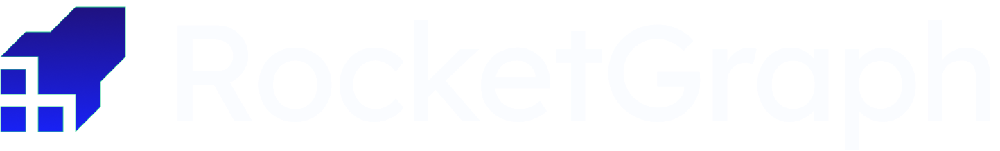

<p align="center">
  <a href="https://rocketgraph.app">
    
  </a>
</p>

<h1 align="center">
  RocketLogs - Detective
</h1>

<h3 align="center">
  Find the needle in the log haystack
</h3>

<p align="center">
  <strong>ML-powered anomaly detection that surfaces what matters from millions of telemetry events</strong>
</p>

<p align="center">
  <a href="https://rocketgraph.app">Website</a>
  &nbsp;&bull;&nbsp;
  <a href="#getting-started">Getting Started</a>
  &nbsp;&bull;&nbsp;
  <a href="#example-setups">Examples</a>
  &nbsp;&bull;&nbsp;
  <a href="https://discord.gg/YHVnZ5WT">Discord</a>
</p>

<p align="center">
  
  
  
  
</p>

---

## What is Detective?

Detective uses machine learning to automatically surface anomalies from your logs and telemetry data. Stop manually trawling through logs during incidents - let Detective find the signals that matter.

```
Raw Logs (2.4M events) -> Embeddings (768-dim vectors) -> Clusters (42 groups) -> Anomalies (3 detected)
```

### Key Capabilities

| Feature | Description |
|---------|-------------|
| **K-means Clustering** | Transforms logs into high-dimensional vectors using embeddings, then clusters by semantic similarity |
| **Isolation Forest** | Unsupervised ML algorithm that isolates anomalies - logs that don't fit normal patterns |
| **Smart Alerting** | LLM-powered alert gate reduces noise and routes only actionable alerts |
| **Universal Ingestion** | Pull logs from Datadog, New Relic, Sentry, Loki, or via OpenTelemetry |

### How It Works

```
┌─────────────┐     ┌─────────────┐     ┌─────────────┐     ┌─────────────┐     ┌─────────────┐
│   Ingest    │────>│   Analyze   │────>│    Store    │────>│  Integrate  │────>│    Alert    │
│             │     │             │     │             │     │             │     │             │
│  Datadog    │     │  K-means    │     │  Clustered  │     │  Webhooks   │     │  LLM Filter │
│  New Relic  │     │  Isolation  │     │  Logs       │     │  Claude     │     │  Smart      │
│  Loki       │     │  Forest     │     │  Anomaly    │     │  Slack      │     │  Routing    │
│  OTel       │     │  Scoring    │     │  Scores     │     │  Discord    │     │             │
└─────────────┘     └─────────────┘     └─────────────┘     └─────────────┘     └─────────────┘
```

---

## Why Detective?

| Metric | Value |
|--------|-------|
| Avg time to root cause | **87ms** |
| Anomaly detection accuracy | **93%** |
| Logs analyzed per second | **100k/s** |

Detective automatically detects patterns like:

- `FATAL: connection pool exhausted, no available connections`
- `ERROR: timeout waiting for lock on payments_table`  
- `WARN: retry limit exceeded for transaction abc123`

---

## Getting Started

### Prerequisites

- An account on [rocketgraph.app](https://rocketgraph.app)
- Access to your observability platform (Datadog, New Relic, Loki, etc.) OR an OpenTelemetry setup

### Quick Start

1. **Sign up** at [rocketgraph.app](https://rocketgraph.app)
2. **Connect your log source** (Datadog, New Relic, Loki, or OTel collector)
3. **Start detecting anomalies** - Detective begins clustering and scoring immediately

---

## Example Setups

This repository contains example configurations for integrating various observability stacks with Detective via OpenTelemetry collectors.

### Repository Structure

```
example-setups/
├── otel-collector/          # OpenTelemetry Collector configurations
│   ├── datadog/             # Datadog to Detective via OTel
│   ├── newrelic/            # New Relic to Detective via OTel
│   ├── loki/                # Grafana Loki to Detective via OTel
│   └── kubernetes/          # K8s cluster logging to Detective
├── docker-compose/          # Docker Compose setups for local testing
└── helm-charts/             # Kubernetes Helm charts for production
```

### Supported Integrations

| Platform | Status | Documentation |
|----------|--------|---------------|
| OpenTelemetry | Supported | `example-setups/otel-collector/` |
| Datadog | Supported | `example-setups/otel-collector/datadog/` |
| New Relic | Supported | `example-setups/otel-collector/newrelic/` |
| Grafana Loki | Supported | `example-setups/otel-collector/loki/` |
| Kubernetes | Supported | `example-setups/otel-collector/kubernetes/` |
| Sentry | Supported | Coming soon |

---

## OpenTelemetry Collector Configuration

Detective natively supports OpenTelemetry for log ingestion. Here's a basic collector configuration:

```yaml
# otel-collector-config.yaml
receivers:
  otlp:
    protocols:
      grpc:
        endpoint: 0.0.0.0:4317
      http:
        endpoint: 0.0.0.0:4318

processors:
  batch:
    timeout: 1s
    send_batch_size: 1024

exporters:
  otlphttp:
    endpoint: https://ingest.rocketgraph.app
    headers:
      Authorization: "Bearer ${ROCKETGRAPH_API_KEY}"

service:
  pipelines:
    logs:
      receivers: [otlp]
      processors: [batch]
      exporters: [otlphttp]
```

### Environment Variables

| Variable | Description |
|----------|-------------|
| `ROCKETGRAPH_API_KEY` | Your Detective API key from the dashboard |
| `ROCKETGRAPH_PROJECT_ID` | Your project identifier |

---

## Webhook Integrations

Detective can forward anomalies to your preferred alerting system:

```json
{
  "type": "anomaly",
  "score": 0.94,
  "timestamp": "2024-01-15T10:23:45Z",
  "message": "FATAL: connection pool exhausted, no available connections",
  "cluster_id": "db-connection-errors",
  "context": {
    "similar_logs": 127,
    "time_before_crash": "87ms"
  }
}
```

### Supported Destinations

- Slack / Discord
- PagerDuty
- Claude AI Agents
- Custom Webhooks
- Any HTTP endpoint

---

## Pricing

| Plan | Logs/month | Price |
|------|------------|-------|
| **Starter** | Up to 1M | Free |
| **Pro** | Up to 50M | $200/month |
| **Enterprise** | Unlimited | Custom |

All plans include K-means clustering, Isolation Forest detection, and 7+ day retention.

[Get started free](https://rocketgraph.app)

---

## Community

- [Discord](https://discord.gg/YHVnZ5WT) - Join our community for support and discussions
- [Twitter](https://twitter.com/RGraphql) - Follow for updates

---

## Contributing

We welcome contributions! Check out the example setups and feel free to submit PRs for:

- New OTel collector configurations
- Integration examples for other platforms
- Documentation improvements

---

## License

This repository is open source. See [LICENSE](LICENSE) for details.

---

<p align="center">
  <strong>Stop searching. Start finding.</strong>
  <br>
  <a href="https://rocketgraph.app">rocketgraph.app</a>
</p>

