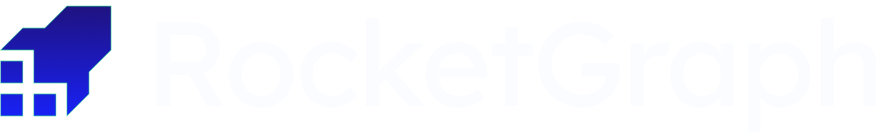
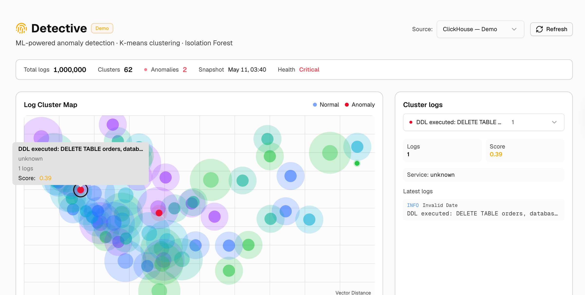

<p align="center">
  <a href="https://rocketgraph.app">
    
  </a>
</p>

<h1 align="center">Rocketgraph 🚀</h1>

<p align="center">
  <strong>Self-hosted log clustering and streaming anomaly detection that drops in next to the observability stack you already run.</strong>
</p>

<p align="center">
  <a href="#whats-in-here">What's in here</a>
  &nbsp;&bull;&nbsp;
  <a href="#try-it-in-90-seconds">Quick start</a>
  &nbsp;&bull;&nbsp;
  <a href="#examples">Examples</a>
  &nbsp;&bull;&nbsp;
  <a href="https://rocketgraph.app">Website</a>
  &nbsp;&bull;&nbsp;
  <a href="https://discord.gg/dqwkEpSc">Community</a>
</p>

<p align="center">
  
  
  
  
</p>

---

<p align="center">
  
</p>

## Why?

Your monitoring tool tells you what you *searched for*. It rarely tells you what's **unusual right now**.

Rocketgraph sits next to whatever you already pay for — Datadog, New Relic, Loki, CloudWatch, Sentry, ClickHouse — pulls a window of logs, mines structural templates, and flags the anomalous ones. It runs entirely inside your network. Your logs never leave your VPC. There's no SaaS tier to pay for.

## What's in here

| Component | What it does |
| --- | --- |
| 🧠 **[ML engine](./ml)** | Clusters logs into structural templates and detects anomalies. Pulls directly from your existing log source — no parallel ingest pipeline. |
| ⚡ **[`@rgraph/otel-node`](./packages/otel-node)** | AI agent that auto-instruments any Node.js service with OpenTelemetry in ~90 seconds. |

## Try it in 90 seconds

```bash
git clone https://github.com/Rocketgraph/rocketgraph
cd rocketgraph/ml
cp .env.example .env             # fill in whichever sources you have
docker compose up --build        # → http://localhost:9020
```

Point it at any source you already use:

```bash
curl 'http://localhost:9020/clusters?source=loki&window=1h'
```

Or skip the credentials entirely — **download a log file and run it.** Export from Datadog (CSV/JSON), `kubectl logs > app.log`, or any raw log, drop it in, and analyse it locally:

```bash
curl -XPOST 'http://localhost:9020/clusters/train?source=file'   # FILE_PATH=/data/app.log
```

See the one-command [log-file quickstart](./example-setups/logfile-quickstart/).

That's the whole install. No schemas to provision, no accounts to create, no agents on hosts.

👉 **Deep dive:** [`ml/README.md`](./ml/README.md) for the ML engine · [`packages/otel-node`](./packages/otel-node) for the OTel agent

## How it works (30-second version)

Three deterministic algorithms in sequence — no LLM, no hallucination, fully reproducible:

1. **Drain3** mines structural templates from raw log lines.
2. **Isolation Forest** scores templates per service to surface the unusual ones.
3. **Half-Space-Trees** scores brand-new logs against the trained model in real time.

On a real production burst we test against: **2M logs → 58 templates → 9 anomalies, 90 seconds wall-clock, single container.** Full details in [`ml/README.md`](./ml/README.md).

<p align="center">
  
</p>

## Examples

[`example-setups/`](./example-setups) contains end-to-end reference apps you can point `otel-node` at to see the whole pipeline working — instrument the service, ship OTLP into your sink, then watch Rocketgraph cluster and flag the logs.

| Example | What it shows |
| --- | --- |
| [`bookstore-app`](./example-setups/bookstore-app) | Express + TypeScript service auto-instrumented by `@rgraph/otel-node` — the easiest way to see traces, metrics, and logs flowing into Rocketgraph end-to-end. |

More examples (Fastify, NestJS, Next.js) are on the roadmap — PRs welcome.

## Compatibility

| Status | Platforms |
| --- | --- |
| ✅ Supported | Log file (`.log`/`.json`/`.csv`) · OpenTelemetry · Loki · New Relic · Datadog · CloudWatch · Sentry · ClickHouse |
| 🛣️ Roadmap | Splunk · Elastic / OpenSearch · Azure Monitor · GCP Cloud Logging |

## Community

- 💬 [Discord](https://discord.gg/dqwkEpSc) — support and design discussions
- 🐛 [GitHub Issues](https://github.com/Rocketgraph/rocketgraph/issues) — bugs and feature requests
- 🐦 [@RGraphql](https://twitter.com/RGraphql) — release notes

## Contributing

PRs welcome. The most impactful contributions right now:

- New ML connectors (Splunk, OpenSearch, Azure Monitor, GCP Cloud Logging)
- Additional framework support in `@rgraph/otel-node` (Fastify, NestJS, Remix, Bun-native services)
- More end-to-end reference apps under `example-setups/`

See [`ml/README.md`](./ml/README.md) and [`packages/otel-node`](./packages/otel-node) for the deep-dive docs.

## License

Apache 2.0. See [LICENSE](LICENSE.txt).

---

<p align="center">
  <strong>Self-hosted. Open source. Drops in next to what you already run.</strong><br>
  <a href="https://rocketgraph.app">rocketgraph.app</a>
</p>
